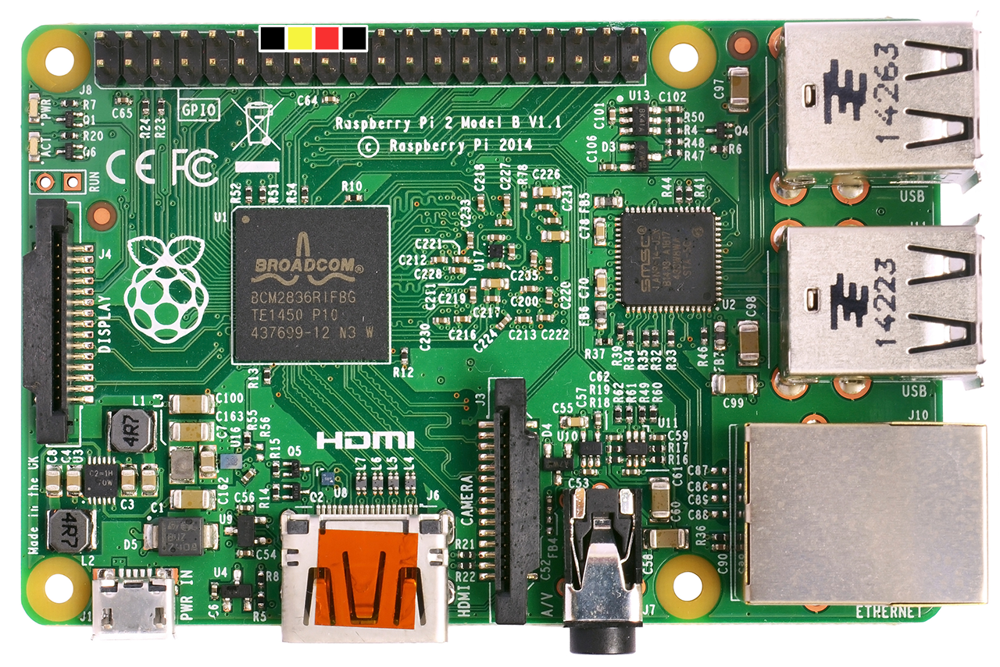

## Sales Button using a Raspberry Pi

Create a digital sales button that plays a custom sound effect when pressed.

### What you’ll need
* Raspberry Pi (with power cable, SD card, and an internet connection)
* Speakers (analog using 3.5mm jack or HDMI + cable)
* Button or activation trigger (I used a [Massive Arcade Button](http://littlebirdelectronics.com.au/products/massive-arcade-button-with-led-100mm-red))
* Custom `WAV` sound effect (optional)

### Initial Setup
The project runs on [Arch Linux ARM](https://archlinuxarm.org/), and supports both [Raspberry Pi](https://www.raspberrypi.org) models A and B. To install Arch Linux ARM on your Raspberry Pi, follow the instructions for your specific device. It will likely run on the Raspberry Pi Zero as well, using the HDMI audio output, but it hasn't been tested. You'll also need to setup internet using [wireless](https://wiki.archlinux.org/index.php/Wireless_network_configuration) or ethernet.
* [Raspberry Pi 1](https://archlinuxarm.org/platforms/armv6/raspberry-pi)
* [Raspberry Pi 2](https://archlinuxarm.org/platforms/armv7/broadcom/raspberry-pi-2)
* [Raspberry Pi 3](https://archlinuxarm.org/platforms/armv8/broadcom/raspberry-pi-3)

### Installation
To make deployment easier, this project uses [Ansible](https://www.ansible.com) to automatically bootstrap, deploy, and configure the Pi. Please note that the default user login/password for Arch Linux ARM is `alarm/alarm`, and the root password is `root`.

1\. Download the project from Github on your local machine

```bash
$ git clone https://github.com/blakejakopovic/red_button.git
$ cd red_button

```

2\. Create your Ansible host config file using the `rpi_host.sample` template
```bash
$ cp rpi_host.sample rpi_host
$ nano rpi_host
# edit the IPADDRESS variable to match your Raspberry Pi
```

3\. [Install Ansible](http://docs.ansible.com/ansible/intro_installation.html) version 2.0+ on your local machine.

4\. On your local machine, run the following command to bootstrap the Raspberry Pi. Be aware that this may take more than 60 minutes as it performs a full system upgrade, and installs additional dependancies. Your Raspberry Pi should automatically restart after setup it is completed. The Pi will automaticaly restart when finished to complete the setup.
```bash
$ ansible-playbook -i rpi_host red_button_init.yml
 ```

5\. Once your Pi is back online, run the following to deploy the project files.
```bash
$ ansible-playbook -i rpi_host red_button_deploy.yml
 ```

### Custom sound effect
Overwrite `assets/tune.wav` with your `WAV` file. It will automatically be copied over in the `red_button_deploy.yml` playbook. Run the step 5 command again if you wish the update the sound using Ansible.

If you want to change your sound effect manually, just shut down the Raspberry Pi, put your SD card into a reader, and copy your new file to `/boot/tune.wav`. This should work on Windows, OS X and Linux, as the boot partition is setup as FAT. Then reboot the Pi, and the new sound should automatically load.

### Wiring it up
By default, the script uses the BCM pin layout, with GPIO pin 23 for the Button, and GPIO 24 for the LED. The Button GPIO has the internal resistor pulled up, so the button is activated when connected to ground. The pins can be changed in `vars.yml`, but were chosen because they are both conveniently close to ground pins. Button debouncing isn't required, as the script only checks for button presses after the sound effect has finished playing.


* Black wires are ground
* Yellow wire is connected to the button (GPIO 23)
* Red wire is connected to the LED (GPIO 24)

If you don't have a button with an in-built LED, or only want to use a button, that's fine. Just connect the button by itself.

### Final step
Reboot your Raspberry Pi, and everything should automatically start. Plug in your speakers (defaults to 3.5mm jack output). Try pressing your button! 

Note: If you have a LED wired in, it will flash 2 times when the Raspberry Pi has booted and is ready. Please give the Pi 30 seconds to boot up after you turn it on, or wait for the flashes.

### References
Default sound effect [Level Up 01](https://www.freesound.org/people/rhodesmas/sounds/320655/) by [Andy Rhode](https://www.freesound.org/people/rhodesmas/) ([CC Attribution 3.0](https://creativecommons.org/licenses/by/3.0/au/deed.en))

[Raspberry Pi image](https://commons.wikimedia.org/wiki/File:Raspberry_Pi_B%2B_top.jpg) (Modified) By Lucasbosch ([CC Attribution-ShareAlike 3.0](https://creativecommons.org/licenses/by-sa/3.0/deed.en) via Wikimedia Commons)